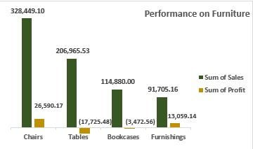

# SUPERSTORE SALES INSIGHTS

## INTRODUCTION
We embarked on a project to analyze sales data collected from a hypothetical Superstore based in the United States of America that operated outlets over a four-year period. The aim of the project was to help the management of the store to gain valuable insights that will help them to make informed business decisions to enhance performance.

By examining the sales data, we set out to proffer answers to the following Business Questions:
Questions:

1.	How did the Product Categories rank in terms of sales and profit?

2.	Which products are the best-selling in the superstore, and what is their sales trend over the past year?

3.	Which are the poorest-performing products? 

4.	How did sales vary across the different regions?

5.	What are the Top Performing cities in terms of sales?

6.	Is there a Periodic pattern in sales, and if so, what are the peak periods?
   
## KEY PERFORMANCE INDICATORS
The Key Performance Indicators are:
1.	Sales Revenue
2.	Profit
   
## DATA SET

### DATA SOURCING
We used a dataset of a superstore’s Nine Thousand Nine Hundred and Ninety-Four sales orders, spanning across 50 states and over four years, covering revenue and profit made on a cross-section of products purchased by clients categorized under consumer, Corporate, and Home-office market segments. 

### DATA TRANSFORMATION
The dataset required manipulation, so we used Pivot tables to summarize the data on Microsoft Excel.

## SKILLS DEMONSTRATED
i.	Data manipulation on Microsoft Excel PIVOT TABLES where we compared Total Sales Revenues across products, regions and Cities. 
ii.	Data Visualization on Microsoft Excel Using Column Charts, Bar Charts, Line Graphs, and Doughnut Charts

## ANALYSIS AND VISUALIZATIONS

### Product Performance
The business realized its highest Revenue and Profit from selling technology products while Office Supplies achieved the second-highest profit despite realizing the least revenue among the product lines. In contrast, the strong sales revenue from Furniture did not translate to significant profit as the product barely broke even for the period under review. 

A review of product performance using a column chart of product subcategories plotted against the Total Sales Revenue on the vertical axis revealed that Phones sold faster than any other product and contributed the highest revenue. Chairs and storages were the next two biggest performers.

Further evaluation using a column chart again, with both Total sales and Profit on the vertical axis revealed that whilst profit margins were generally thin on furniture products, the store made losses on the sale of tables and bookcases. These losses were largely responsible for the underwhelming profit of that product line.

### Regional Performance
We utilized the doughnut chart to depict Sales figures from the regions that showed that the West and East, collectively contributed over 61% of revenue, while the Central and Southern regions achieved 21.82% and 17.05%, respectively.

Cities from the West and East were predictably the biggest revenue earners. From the East, New York topped the 5-year sales revenue bar chart with an income worth $256,368.16, while Philadelphia, another Eastern City achieved the Fifth largest revenue.  The Western Cities of Los Angeles, Seattle, and Francisco were second, third, and fourth largest earners, in that order. Is further explained in the bar chart where the cities were placed on the vertical axis, while total sales from each city was plotted on the horizontal axis.

### Seasonal Performance
Analysis of sales revenues from the year 2014 to 2017 was done using line graphs for each respective year represented in different colors but plotted on the same chart with Toal Sales on the vertical axis and Quarters of each year on the horizontal axis. 

It revealed a consistent pattern across each year. Revenues were always comparatively lower in the first quarter of every year, before improving progressively from Quarter-two to the end of the year. The peak period for business has constantly been between October and December.

## CONCLUSION
1.	Technological Gadgets were the major ‘cash cow’ of the superstore, with phones particularly driving both revenue and profit.
2.	The store has been making losses on sales of furniture, particularly Tables and Bookcases
3.	3.	Business Thrives more in Cities within the Eastern and Western Regions of the country, especially New York, Los Angeles, Seattle, San Francisco, and Philadelphia
4.	Sales usually pick up from the second half of each year and reach its peak at the last quarter.

# THANK YOU

